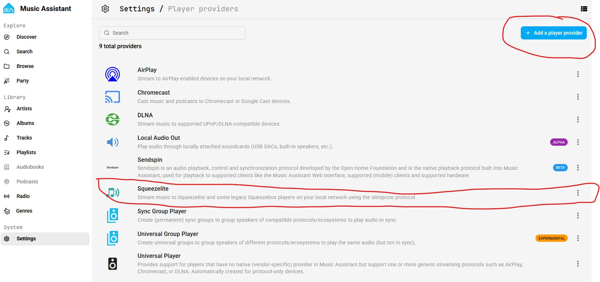
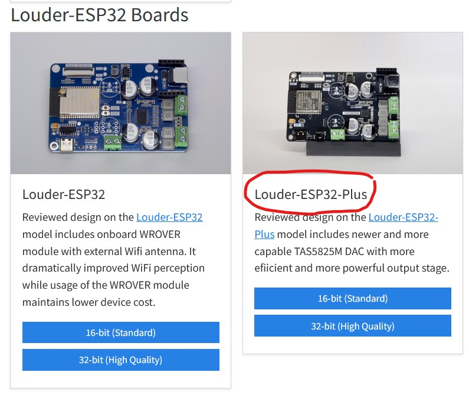
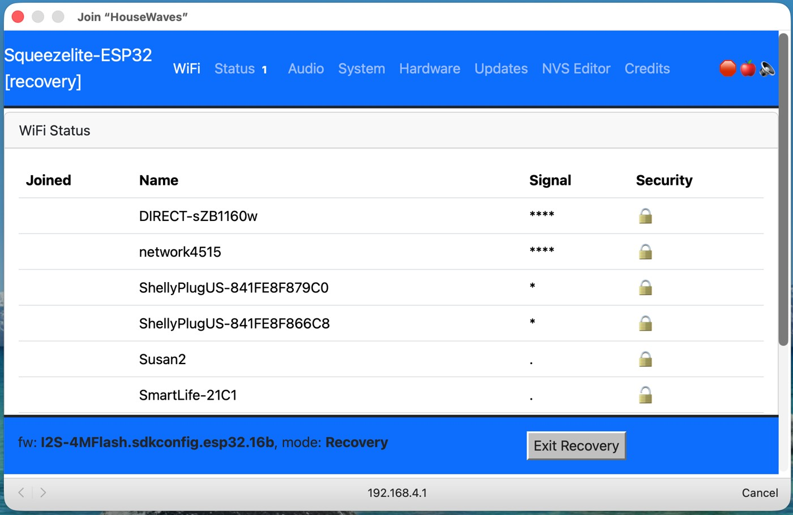
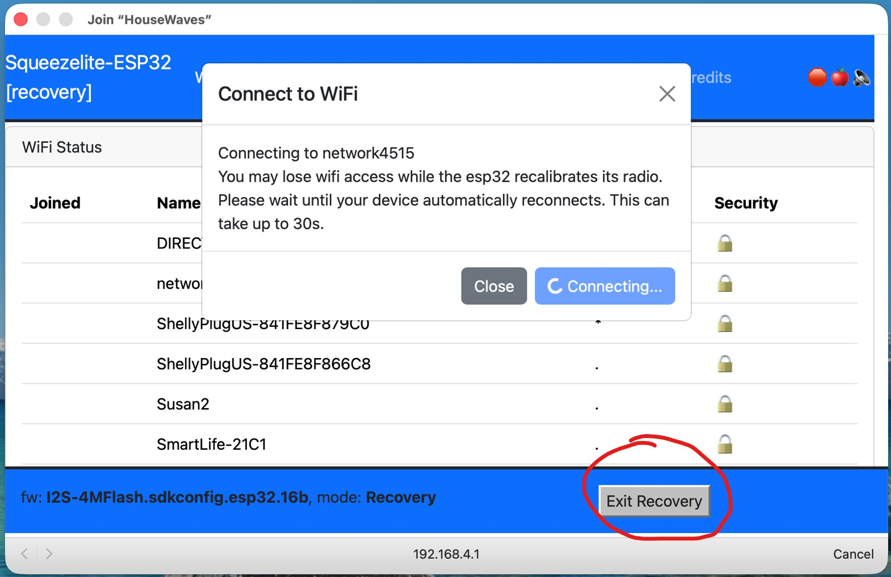

This tutorial covers flashing your speaker with the **Squeezelite-ESP32** firmware.

1. **Before you begin, ensure Music Assistant has Squeezelite installed as a Player Provider**.  Open Music Assistant settings and click on the tab for Player Providers. If it is not yet installed, click on the button in the top right and add it 
   **This is important step - needed to ensure Music Assistant auto-discovers your new speaker.**

   

   

   

2. Connect a USB-C cable to the ESP32 board and your pc or laptop 

3. Open the web-based firmware installer: https://sonocotta.github.io/esp32-audio-dock/

   

4. Scroll to the box for **Louder-ESP32-Plus**, click on the box labeled **16-bit (Standard Quality)**
   (note the readme link at the top of the page, for why to use 16-bit vs 32-bit)

5. Select option to **Install** and follow the prompts. It will take approx 2 minutes as it proceeds

6. After firmware installs, Use a mobile device (phone, tablet, etc.) to:

   a. connect your mobile device to the **board's Wi-Fi SSID: louder-esp32 and password: squeezelite**

   b. Newer devices will automatically open a captive network window with the screen below.  If this does not happen, open a browser and enter: https://192.168.4.1 

   

   

   

   c. Select your home Wi-Fi (2.4GHz only), enter your home Wi-Fi password, select **Join**

   d. **Wait until the dialog box shows your device has connected.** 

   e. Then click on the **Exit Recovery** button near the bottom of the page. 
   (**this is important to "Exit Recovery" instead of reboot.**  Recovery mode is - for lack of a better analogy - *similar to booting in safe mode,* allowing you to restart and configure options for connecting to you home wifi, etc. when you want to start over.

    

   

   f. The device will reboot.  Open Music Assistant and you will see the speaker has now been discovered and available as a new player for streaming and playing notifications.

   

