# V3 - DIY $90 Home Assistant bookshelf speaker with SendSpin or Squeezelite for multi-room music and notifications using off-the-shelf parts. 

### Version 3. Quickly modify an off-the-shelf, compact, dual-driver passive speaker by adding an ESP32/DAC/AMP controller and existing open-source firmware (Squeezelite or ESPHome with SendSpin) for whole-home synchronized audio and TTS notifications using Music Assistant and Home Assistant.

A lot of focus is often placed on syncing the same music in every room, but it's worthwhile mentioning Music Assistant also allows you to play different songs in different rooms.  Stream a chill playlist (synced) to your bedrooms, a house playlist to the family room and a radio station to your kitchen.

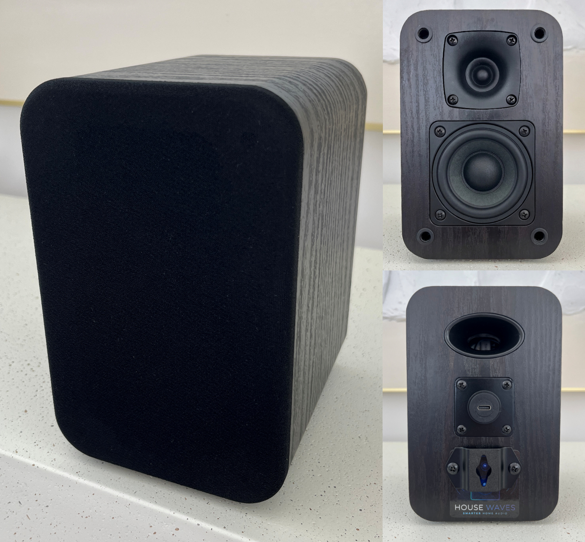
*Completed ESP32 modification of a passive bookshelf speaker for wireless multi-room audio with Home Assistant.*

## See and Hear it

- [35 sec video demo on Reddit - see this speaker (in the MIDDLE), between V2 and the white POC speakers](https://www.reddit.com/user/HouseWaves/comments/1s5jeez/demo_video_tease_starting_lineup_for_diy_home/) 

  

---

## Build it - or Buy it

I've made this project very simple and fast to build.

But not everyone has the time or desire for a DIY project.
If that's you, please check out an [Option to Purchase - Already Assembled](#option-to-purchase---already-assembled)

---

## Table of Contents

- [What This Is](#what-this-is)

- [Motivation](#motivation)

- [Option to Purchase - Already Assembled](#option-to-purchase---already-assembled)

- [Caveats & Limitations](#caveats--limitations)

- [Parts & Materials](#parts--materials)

- [Tools Required](#tools-required)

- [Build Time](#build-time)

- [Step-by-Step Build Guide](#step-by-step-build-guide)

- [What's Next](#whats-next)

- [Non-Commercial Use Only](#non---commercial-use-only)

- [Credits & References](#credits--references)

  

---

## What This Is 

- A documented process to easily and quickly create your own inexpensive Home Assistant speaker - with really reasonable fidelity - using commercially available passive speakers into a Wi-Fi speaker for use with Home Assistant.
- A DIY guide to adding an inexpensive, off-the-shelf ESP32-based controller with integrated DAC, DSP and AMP inside an existing speaker cabinet and flash with existing, open-source firmware to use Squeezelite, SendSpin, Snapcast or AirPlay streaming protocols. 
  **SendSpin can be used with the ESPHome firmware. I have been speaking and working with the SendSpin team to add configuration changes that significantly improve ESP32 performance using SendSpin. I will update this repo {est. May 2026} with details and instructions.**
- Provide Music Assistant users a viable alternative to purchasing Sonos equipment to obtain satisfying whole-home, multi-room synchronized audio, streaming music and home automation notifications.
- **Part of a planned series modifying a range of speakers at multiple price points and corresponding sound quality.**
  — see [What's Next](#whats-next) for planned future builds for high-fidelity, subwoofer and smart options.
- An [option to purchase](#option-to-purchase---already-assembled) pre-assembled for those wanting a commercially available speaker. 

**This is NOT:**

- A project that requires wood working skills to build a speaker cabinet from scratch.  At most, you may need to drill a single hole into a wood cabinet - or have someone 3D print a small plate for you. There are companies that can provide you with custom printed plastic or laser cut acrylic plates as well (approx $10)

- A smart speaker. Stay tuned for a future build this year. I am working to create smart speakers fully-compatible with Home Assistant Voice Preview.

  

---

## Motivation

There are no commercially available speakers specifically for use in the Home Assistant platform. Sure, you can find WiFi and BT speakers that can be integrated into HA, but they are either expensive, proprietary, complicated to integrate, etc., etc.

I want to change that.

***My first project***, really more of a proof-of-concept, started with a high end speaker kit. It was expensive.
https://www.reddit.com/r/homeassistant/comments/1qw1gg6/diy_wifi_bt_audio_speaker_for_home_assistant/

It sounded great!  But $250 / speaker was not what people wanted. 

***My second project*** was a much lower cost version based on a commonly available single-driver speaker available on Amazon. [V2 - $60 DIY WiFi & BT audio speaker for Home Assistant, with ESP32 - Squeezelite or SendSpin : r/homeassistant](https://www.reddit.com/r/homeassistant/comments/1skggdr/v2_60_diy_wifi_bt_audio_speaker_for_home/)

A very nice desktop-sized solution, albeit with limited power and frequency range, ideal for replicating in multiple rooms primarily for notifications and occasionally listening to music (or secondary rooms as part of a whole home, multi-room system).  

-------

The following guide is to help you recreate the speaker from ***My third project (V3)*** 

A dual-driver, bookshelf speaker capable of providing quality audio in a compact form factor.  

15W of amplification to adequately fill most rooms of your home in a cabinet size slightly larger than the V2 desktop speaker.

Quick and easy to integrate with firmware designed specifically for use with Home Assistant. 

Although I still recommend Squeezelite until SendSpin is finalized, ESPHome with the SendSpin protocol is very capable with significant improvements even on an ESP32, thanks to suggestions from the SendSpin beta development team!

---

## Option to Purchase - Already Assembled

My motivation is not completely altruistic.

I've started a company, with a commitment to prioritize and provide DIY open-source audio options to Home Assistant enthusiasts.  

For individuals who prefer to purchase a speaker fully assembled and tested, well...that's the market I'd like to help with...I want to be the RATGDO for music enthusiasts looking for options that do not require subscriptions or proprietary applications.

Please check out my site, [GetHouseWaves.com](https://gethousewaves.com/)  to view available models - all based on the same components you'll find in my DIY guides.

---

## Caveats & Limitations

- Speaker DAC and AMP power is provided by a remarkable ESP32 board called "LOUDER" by Sonocotta. Amplification is 3-4X the power of the "LOUD" board used in the previous project.  

- The board provides options to use both (or either) a USB-C adapter and an external power supply.  To simplify DIY build time and provide thermal protection to the board, I have used only the USB-C connection to limit power to 15W. This is roughly what most mobile phone adapters supply  (USB-C at 5V, 2-3A).   *Using an external supply to play at volumes requiring more than 15W will cause the board to overheat.*

- ***Speakers benefit from "run-in" time to loosen the driver suspension and improves audio quality over time.*** 
  I really want to reiterate this.  
  *Speaker drivers are stiff when new and improve from use.*
  *You can actually notice the sound quality of speakers improve over time.* 
  *You can also damage them more easily at this stage by playing them LOUDLY.* 
  We recommend playing at a lower (under 50%) volume setting for at least 50-100 hours before testing how loud they can go. 
  
  

---

## Parts & Materials

---

Prices shown are approximate USD and include shipping, taxes and customs fees (to someone in California). 

Speakers are sold in pairs, but other parts are sold individually. Adjust quantities if you plan to build both.

Links are for the actual products I purchased for building the POC.

After posting the V2 build, many people asked for a US-based option to purchase the ESP32 boards. If that is still of interest, please mention in the Reddit post and I will set up an option to purchase as a "kit"  

| #    | Component                                                    | Qty        | Price | Notes                                                        |
| ---- | ------------------------------------------------------------ | ---------- | ----- | ------------------------------------------------------------ |
| 1    | [Riowois Passive Bookshelf Speakers](https://www.amazon.com/dp/B0CN8V8R6Q) | 2 cabinets | $39   | $20/speaker;  need to buy outside the US? search for Riowois DS6500M |
| 2    | [Sonocotta LOUDER ESP32 - Sold by Elecrow](https://tidd.ly/48waQqJ)   or   [Sonocotta LOUD ESP32 - Sold by Lectronz](https://lectronz.com/products/louder-esp32) | 1          | $32   | $24 + $8 from Elecrow ESP32 with integrated DAC & AMP;  - no Ethernet module;  - optional $5 RPi case to protect the circuit board **buy two if modifying both speakers.**    Elecrow based in China but delivers to US with much lower shipping & customs fees.   Lectronz is based in EU for purchasing directly from Andriy at Sonocotta     no current US-based reseller, but I will sell in a kit if people would like this option |
| 3    | [USB-C Panel Mount Cable](https://www.amazon.com/dp/B0DRVKR5F4) | 1          | $15   | improved version since v2; the threaded portion is hidden inside the cabinet along with the retaining nut **buy two if modifying both speakers.** |
| 4    | Optional back plate                                          | 1          | $2    | If you have access to a 3D printer, print the 1.5" square plate (STL file included).   Another option is to [order custom 3D printing from Elecrow](https://tidd.ly/4tkovc0) or similar DIY service company. They are as cheap as $2 for two, plus shipping Otherwise, you can just drill a small hole in the back of the cabinet for the cable.   **print two if modifying both speakers.** |
|      |                                                              |            |       |                                                              |

------

## Tools Required

- Phillips screwdrivers (regular size for panel screws and small size for circuit board)
- Wire cutter/stripper
- Pliers (tighten the cable retaining nut)
- Access to a 3D Printer (print the retaining plate to hold the USB-C cable)
  -OR-
  Electric drill and 5/8" drill bit (drill hole in the cabinet to hold the USB-C cable)
  *Pro-tip: If you decide to drill into your cabinet, a "brad-point" drill bit will provide a cleaner hole;* 
  *ALSO Place a strip of tape over the drilling location to prevent/limit tearing of the veneer covering.*
- Computer and USB-C cable (firmware install)

---

## Build Time

- Less than 1 hour per speaker.

---

## Step-by-Step Build Guide

### Step 1 — Remove the existing plates on the back

1. Each speaker has a bracket (for hanging on the wall) and a speaker wire connector plate with spring clips. It's easier to remove both for the assembly process and replace the hanging bracket when finished or seal the two screw holes with a black glue.

2. KEEP all the screws, you will likely need them again depending upon the options you choose.

3. Pull open the wire connector plate and cut the speaker wires as close to the connector tabs as possible.  In my speaker, these were red and black.  You will strip the ends of these wires in the next step, to attach to the ESP32 board.

4. **DO NOT CUT other wires inside the cabinet!  **
   **The tweeter and woofer drivers are also connected by wires (white and black in my photos) - these need to remain connected!**
   
   
   
   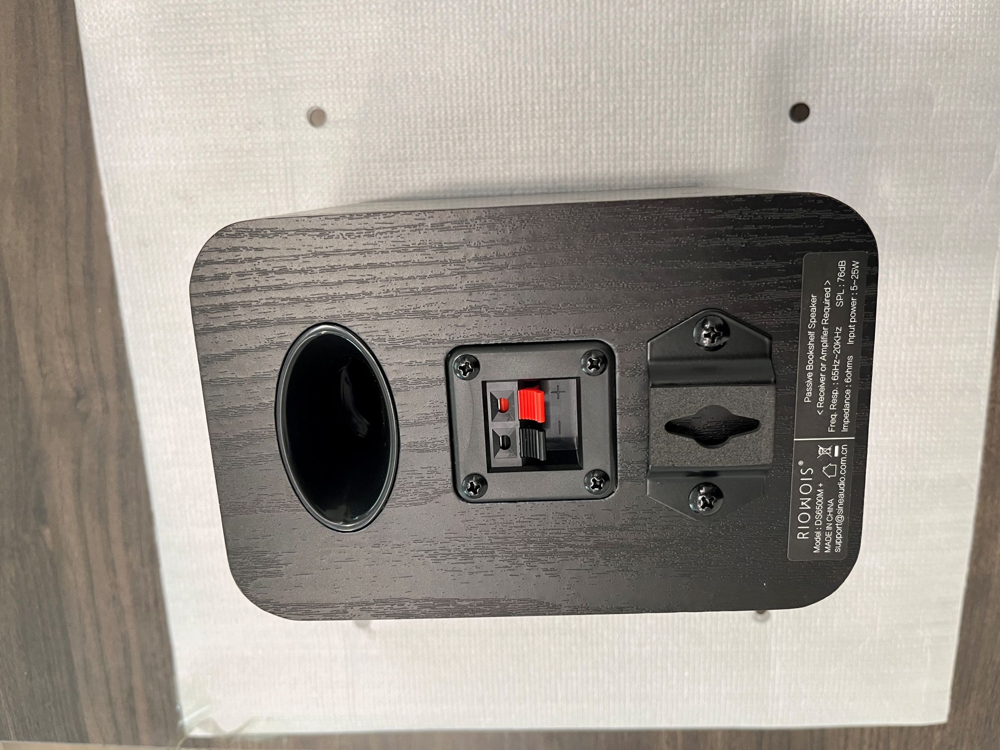
   *Closeup of the speaker back.  Note the hanging bracket and speaker wire connector panel.*

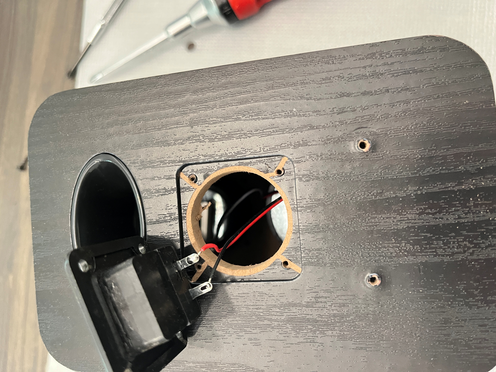
*Closeup of the speaker back with the wire connector plate removed before cutting the speaker wires.*

---

### Step 2 — Remove the driver from the front

1. Loosen screws and gently remove the larger front speaker driver.  You will need this large hole open to insert the ESP32 board inside the speaker cabinet. Note the straight "keyhole" slot cut at the top of the hole - this is where the speaker driver terminals and wire connections will pass through.

   **BE VERY CAREFUL AS THIS DRIVER IS ALSO WIRED TO THE TWEETER - THESE CONNECTING WIRES ARE SHORT!**
   
   

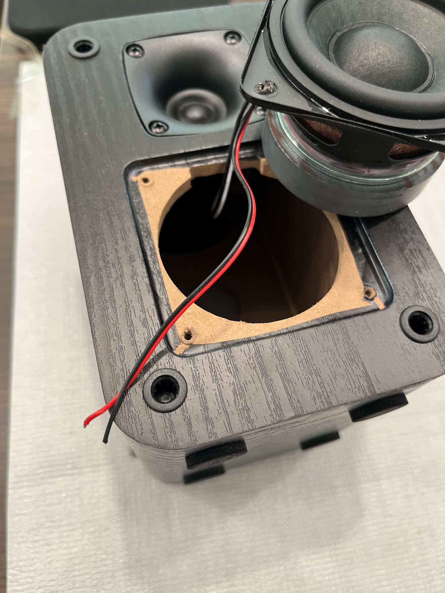
*Closeup of speaker cabinet with the larger (woofer) driver removed. It has TWO sets of wires - the wires you just cut from the back plate AND wires that REMAIN connected to the tweeter still attached to the cabinet.*

---

### Step 3 — Attach main driver wire to the ESP32 board

1. OPTIONAL - if you are using an RPi case for protection, attach the LOUDER ESP32 board to the base (as shown in the photo below).  I recommend not enclosing the board with the top half - only to provide extra air flow to keep the amplifier circuit cool at loud volumes.  

2. Gently strip approx 1/4" on the ends of the red and black driver wires.

3. Attach the wires to the speaker terminals of the LOUD ESP32 board, paying attention to the driver polarity. The red wire was "+" and should be connected to the outermost terminal on the ESP32 board.  One side of the board is for LEFT speaker, the other side of the board is for RIGHT speaker. Your choice on which side you choose. 
   *ADVANTAGE to SQUEEZELITE firmware:  If you are using Squeezelite firmware, Music Assistant will let you change whether it streams LEFT, RIGHT or MONO to the board - in which case it does not matter which side you choose. SendSpin offers options to only stream STEREO or MONO.*
   
   

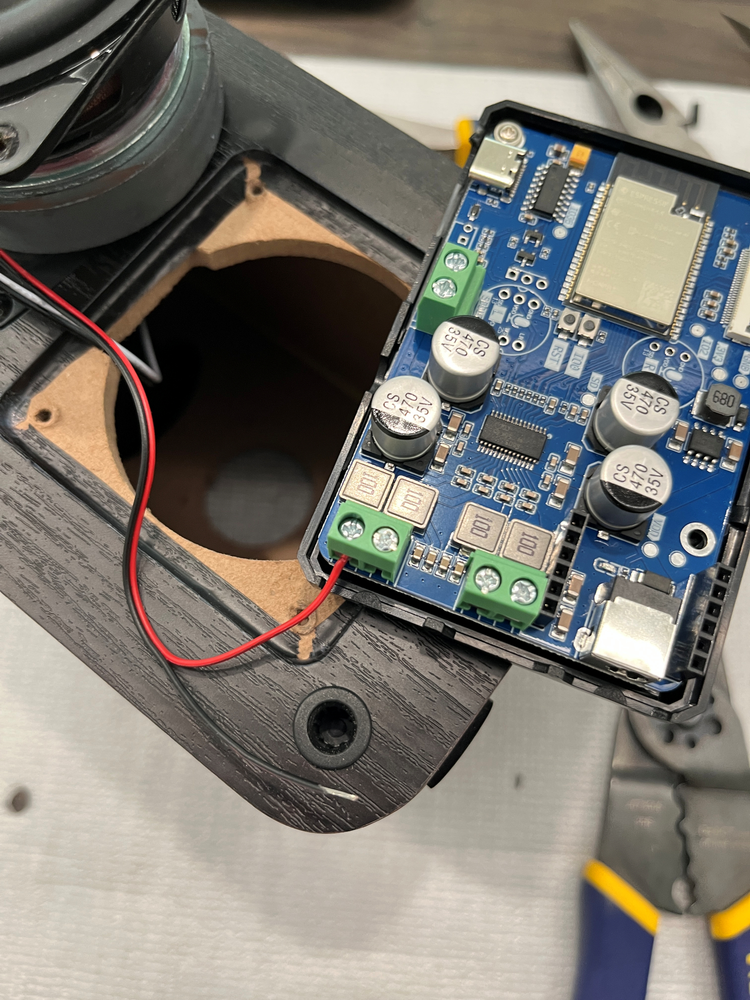
*Connecting the main driver wires to one channel of the LOUDER ESP32 circuit board.*

---

### Step 4 — Install USB-C cable connector

1. TWO OPTIONS:

   ONE -- If you have access to a 3D printer, you can print the 42mm square plate with a hole that fits the USB-C cable as shown in the photo shown below. This plate is the same size and shape as the speaker connector plate you removed. An STL file has been provided for this part. It's small, requires very little filament and takes only minutes to print.

   Insert the threaded USB-C connector inside the hole of the plate, securing in place with the plastic nut.

   *RECOMMENDED - WAIT before re-attaching the plate to the back of the speaker (using same screws that held the wire connector plate in place).  You will want the wiggle room in the cable later, to plug it into the ESP32 board while inside the cabinet.* 

   NOTE - the photo shows a 90 degree "right angle" USB-C connector I used in the POC.  I do not recommend this option - I thought the right angle would make it easier to loop the cable inside the cabinet, but it made the connecting the cable to the ESP32 more difficult. For this reason, the parts table provides a link to a cable that is NOT right angle connector. 

   OR
   
   TWO -- you can drill a 5/8" hole in the back of the cabinet. I did not attempt this, but would suggest placing this hole in one of the upper corners, near the plastic port. The reason is to keep the bottom section open for the ESP32 board, and to provide enough space inside the cabinet for the USB-C cable to loop downwards.
   
   Insert the threaded USB-C connector into the speaker cabinet, through the drilled hole, securing in place with the plastic nut on the back of the speaker cabinet.
   
   

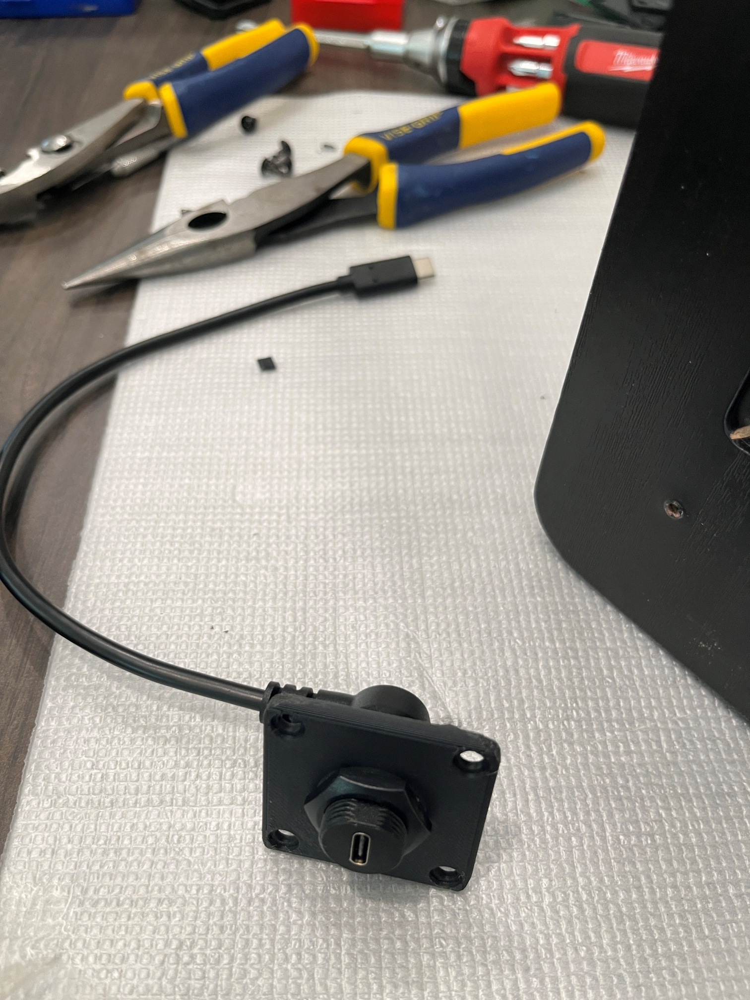
*Closeup of the USB-C connector cable and the 3D printed plate that replaces the original speaker wire plate.*

---

### Step 5 — Flash the ESP32 controller with Squeezelite firmware

This project uses **Squeezelite-ESP32** firmware for seamless Home Assistant integration via Music Assistant. Squeezelite is an open source audio player that streams directly to Music Assistant without requiring ESPHome or YAML configuration.

NOTE - **Sonocotta controllers are also compatible with ESPHome for SendSpin** (Yay!!) and SnapCast.  You may use any of them. There are matrices that discuss the pros and cons of each option. [This is a good starting point to review.](https://sonocotta.com/loud-esp32/) 

We have been actively testing SendSpin and working with their development team to optimize use with ESP32 clients.  They have provided an updated YAML configuration file with updated settings that improve playback (reduce stuttering).  Sonocotta will be updating this file in their repository soon (as of May 1, 2026).  

Also note - you are able to flash and reflash the ESP32 board with any of the available firmware options at any time. *Some reflashing operations require physical access to the board (to press the reset button)!*

1. Connect a USB-C cable to the ESP32 board and your pc or laptop 
     *Pro-tip: Connect your cable from the PC - to the USB-C extension cable in the cabinet - and that cable into the ESP32 (daisy-chain for testing).  This gives you an opportunity to ensure the new speaker cable works for data as well as power.  It's rare you will get a dud cable, but it can happen. See the photo in STEP 7.*

2. Open the web-based firmware installer: https://sonocotta.github.io/esp32-audio-dock/

3. Scroll to the section for **Louder-ESP32 Boards**, click on the box labeled **16-bit (Standard Quality)**
   (note the readme link at the top of the page, for why to use 16-bit vs 32-bit)

   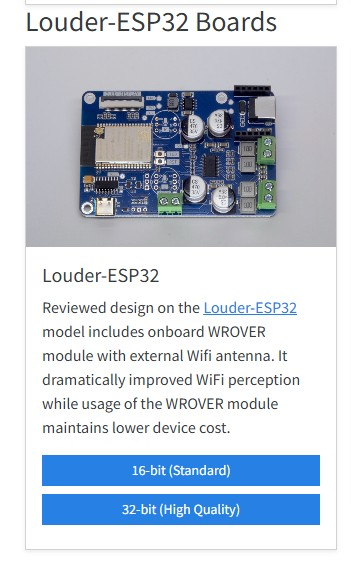

4. Select option to **Install Louder-ESP32-16Bit.** Follow the prompt to **Install** and wait 2-3 minutes as it proceeds

   

5. After firmware installs, return to the menu above, 

   a. select **Logs & Console**

   b. select **download the log** to your laptop (handy - but not necessary - to have for review later)

   c. keep the log open for next step - you can see what IP address it acquires which you may want later

6. Using a mobile device (phone, tablet, etc.), 

   a. connect your mobile device to the **board's Wi-Fi SSID: louder-esp32 and password: squeezelite**

   b. Newer devices will automatically open a captive network window with the screen below.  If this does not happen, open a browser and enter: https://192.168.4.1 

   c. Select your home Wi-Fi (2.4GHz only), enter your home Wi-Fi password, select **Join**

   d. Wait until the dialog box shows your device has connected. Then click on the **Exit Recovery** button near the bottom of the page. (**this is important to "Exit Recovery" instead of reboot.**  Recovery mode is - for lack of a better analogy - *similar to booting in safe mode,* allowing you to restart and configure options for connecting to you home wifi, etc. when you want to start over. You want to exit this mode before using the device in Home Assistant)

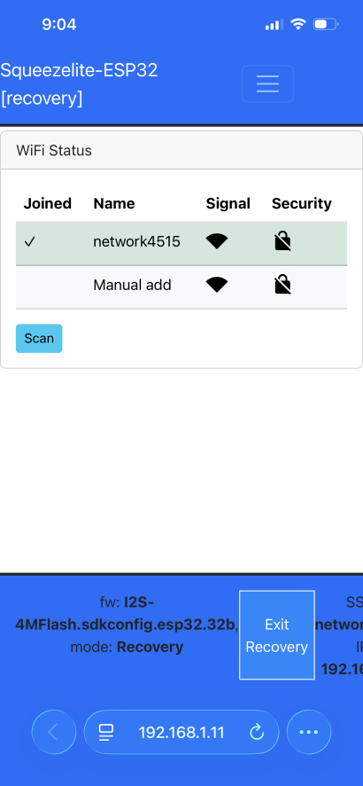

---

### Step 7 — Test Before Closing Up

1. With your speaker still connected by USB-C cable to your laptop, try connecting your mobile device using Bluetooth to test the audio.

4. Then test with Home Assistant / Music Assistant

   a. ENSURE you have Squeezelite already installed as a Player Provider in Music Assistant.

   b. Go to Player Settings in Music Assistant

   c. Confirm the loud-esp32 Squeezelite player appears

   d. Stream a song or play a TTS notification to confirm audio output

   e. Test by changing volume, pausing, and resuming to verify full media player control

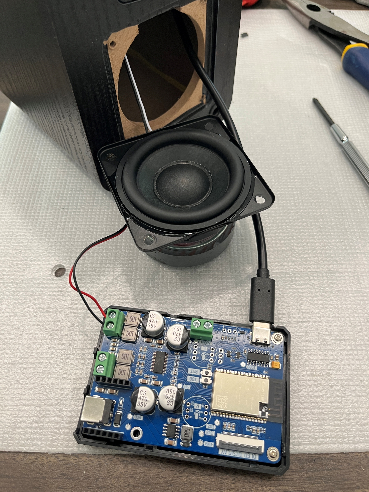
*USB-C connector cable connected to ESP32 for testing with Home Assistant, BEFORE final assembly.*

---

### Step 8 — Final Assembly

1. **You will need to disconnect the USB-C cable from the ESP32 board to slide it inside the cabinet**.

2. Carefully slide the ESP32 board inside the front driver hole, with the green speaker terminals going in first. If you are using a Raspberry Pi case for the bottom, it will barely fit vertically using the keyhole for extra space.

3. Tilt the ESP32 up as you slide it inside, allowing you to rotate the board sideways INSIDE THE CABINET (see photo below), BEFORE reattaching the USB-C plug back into the ESP32.

4. NOTE - it's a tight fit, so the driver wire needs to bend at an angle. The USB-C cable will need to curl around along the base of the cabinet - under the driver hole.  The added tension will help hold the ESP32 board in place against the back wall. You **may** want to use a piece of double-sided tape to hold the case against the wall.  Personally, I choose not to do this - as it will be very difficult to remove the board should you ever desire to do so.

5. Carefully slide the speaker driver back into the cabinet.
   Avoid tugging or twisting any of the connected wires
   Align the speaker wire connections and wires at the top of the hole - it must slide through the extra "keyhole" slot at the top.

6. Fasten the driver to the front using the existing screws and replace the front grille.

   

   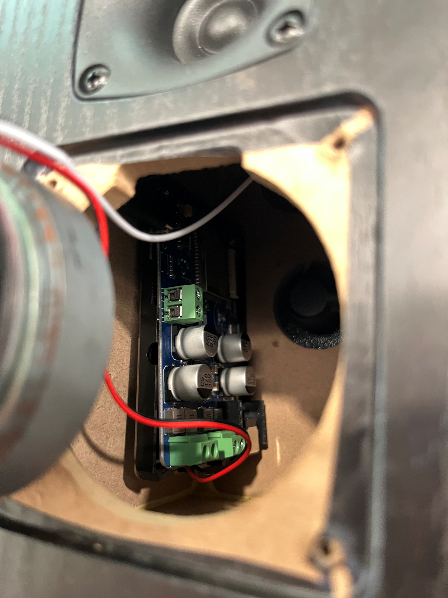
   *ESP32 board (and RPi case bottom) inside the cabinet, placed against the side wall to provide space for the woofer driver. The USB-C cable loops along the bottom of the cabinet - under the speaker hole. Once connected to the ESP32, it pushes against the board to hold it in place.*

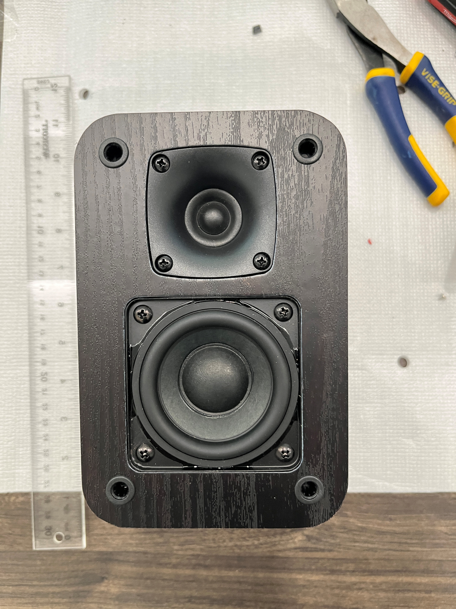
*Woofer driver reattached to the front using screws and ready for reattaching the front grille.*

---

## What's Next

This is **Build #3** in a planned series of passive-to-active speaker conversions using ESP32 for multi-room audio using Music Assistant. 

**Build #4** - A [step-by-step installation guide to install ESPHome firmware](https://github.com/HouseWaves/home-assistant-audio-speaker-v2/blob/main/README%20-%20ESPHome%20with%20SendSpin%20Firmware.md) for SendSpin was added to the V2 DIY guide last week. You can use this same guide as only one step changes - that is the YAML configuration file you need to copy/edit/paste. Instead of selecting the SendSpin YAML file in the LOUD subdirectory, you will need the similar file from the LOUDER subdirectory.
I will update this repo soon with the explicit directions and locations on the file needed, for those who would prefer to wait.

**Build #5** was just completed this weekend (aka HouseWaves-Three).
I will pre-release a limited quantity of assembled HW3 speakers at [GetHouseWaves.com](https://gethousewaves.com/) before the end of May and release the DIY guide for it, as soon as I have some free time to create it. (probably end of May, possibly at the start of June.)

| Build | Speaker                                                      | Status          |
| ----- | ------------------------------------------------------------ | --------------- |
| #1    | HouseWaves POC -  Tozzi One High Fidelity Speaker Kit for Home Assistant | ✅ Complete      |
| #2    | HouseWaves-One: Low-cost (sub $50) single driver speaker     | ✅ Complete      |
| #3    | HouseWaves-Two: Mid-range, mid-cost (sub$100), dual driver speaker | ✅ Complete      |
| #4    | SendSpin firmware for use with HW-One and HW-Two speakers    | ✅ Complete      |
| #5    | Higher-fidelity speaker, competitive option to Sonos for use with Home Assistant | 🔜 May/June 2026 |
| #6    | smart speaker option, compatible with Home Assistant Voice Preview | 🔜 July 2026     |

**Planned future builds:**

- Smart Speaker
- subwoofer - interested in hearing feedback on this.  I've had a couple of people request. I can put together a "quick-and-dirty" option or may wait until after I complete the smart speaker POC.
- Bring-your-own-speaker
  This will be a modular system to update your older passive speakers to Music Assistant.
  I'm very excited about this new project/product.
  Contact me if you have older legacy passive bookshelf speakers (e.g. Pioneer, Polk, JBL, Klipsch) and interested in piloting.
- DAC & Amplifier upgrades, DSP options, higher power speakers (ESP32 Plus)
- ESP32 with Power over Ethernet (PoE) for both powering and streaming to your in-wall and in-ceiling speakers.

---

## Non-Commercial Use Only

##### SUMMARY (For details, please read LICENSE.md)

I developed this speaker modification to be accessible to everyone for learning and enjoyment. To keep the project's spirit alive and ensure it remains open for the Home Assistant and Music Assistant community, here is how I define the boundaries of the **CC BY-NC 4.0** license:

### ✅ What is Encouraged (Personal & Academic)

- **Personal Use, Gifting, Education and Modding.**

### ❌ What is Prohibited (Commercial)

- **Selling Finished Units, Paid Assembly Services, Commercial Production of Units, Commercial Content.**

> **The "Materials Fee" Exception:** If you are organizing a community build or a school workshop, charging a "at-cost" fee to cover the raw price of components (drivers, filament, boards) is perfectly fine. As long as you aren't making a profit on my engineering and documentation, you are within the spirit of the license.

---

## Credits & References

- [Sonocotta Loud ESP32 Documentation](https://github.com/sonocotta/loud-esp)

- [Squeezelite Loud ESP32 Firmware Installation Page](https://sonocotta.github.io/esp32-audio-dock/)

- [Squeezelite-ESP32 GitHub Page](https://github.com/sle118/squeezelite-esp32)

- [Music Assistant for Home Assistant](https://music-assistant.io/)

- [Home Assistant Media Player Integration](https://www.home-assistant.io/integrations/media_player/)

  

---

***Build #2026-05-07 | HouseWaves, Copyright, 2026.***

