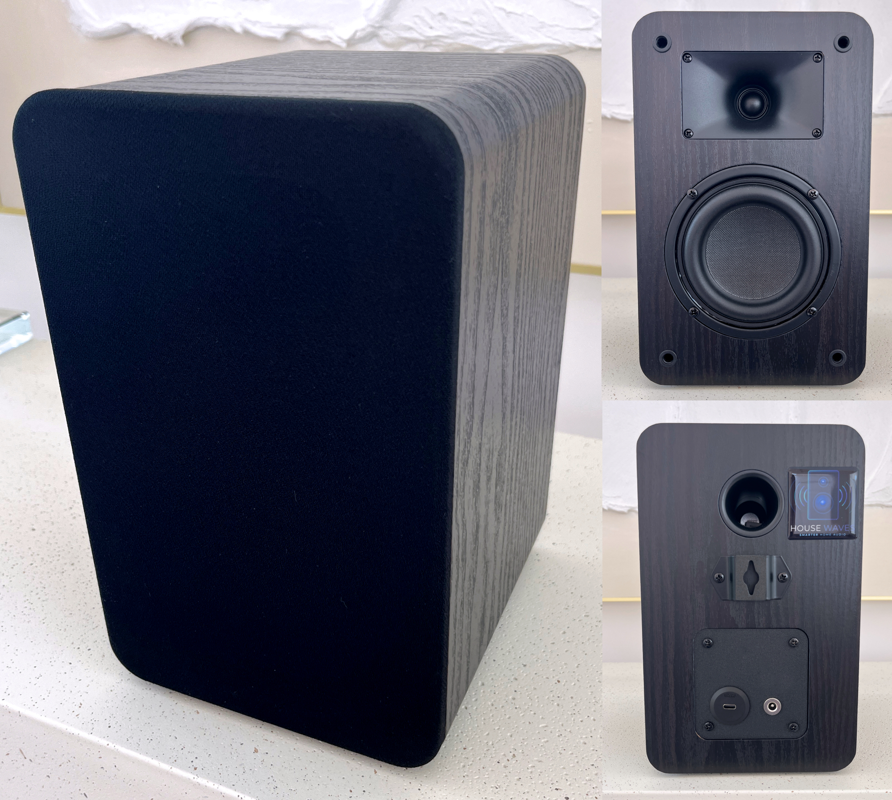
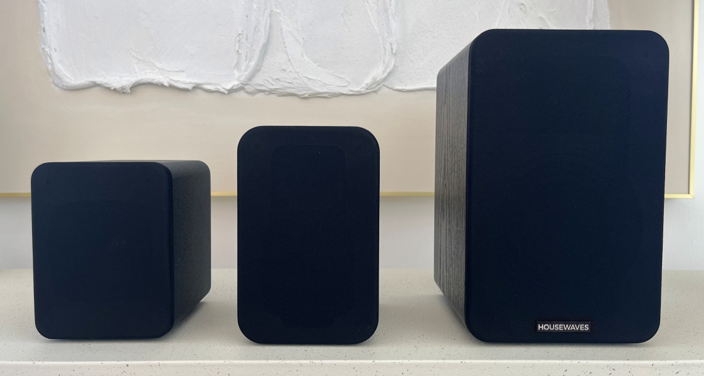
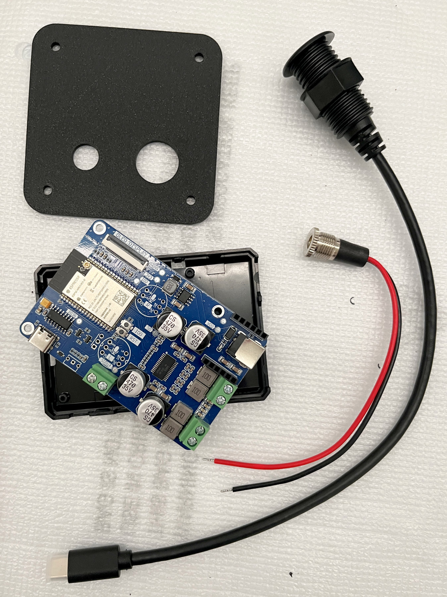
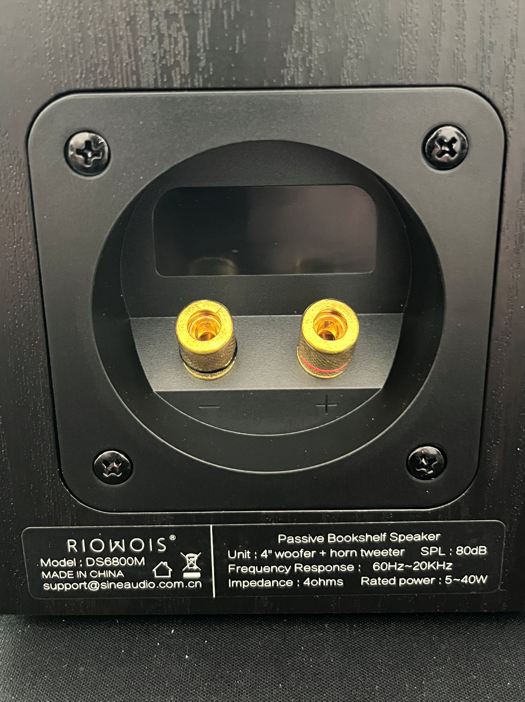
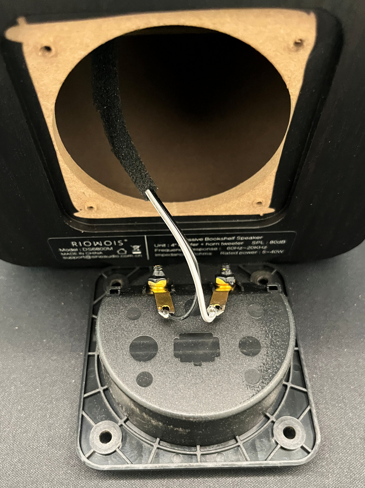
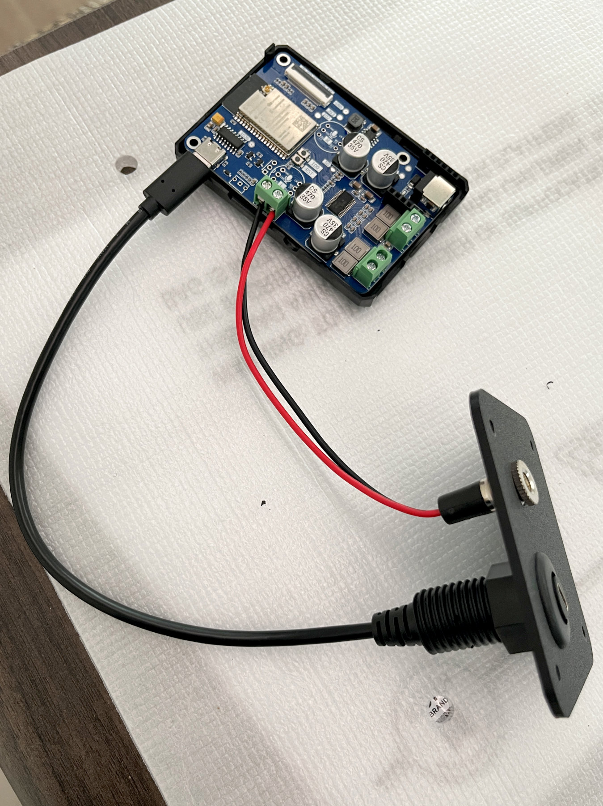
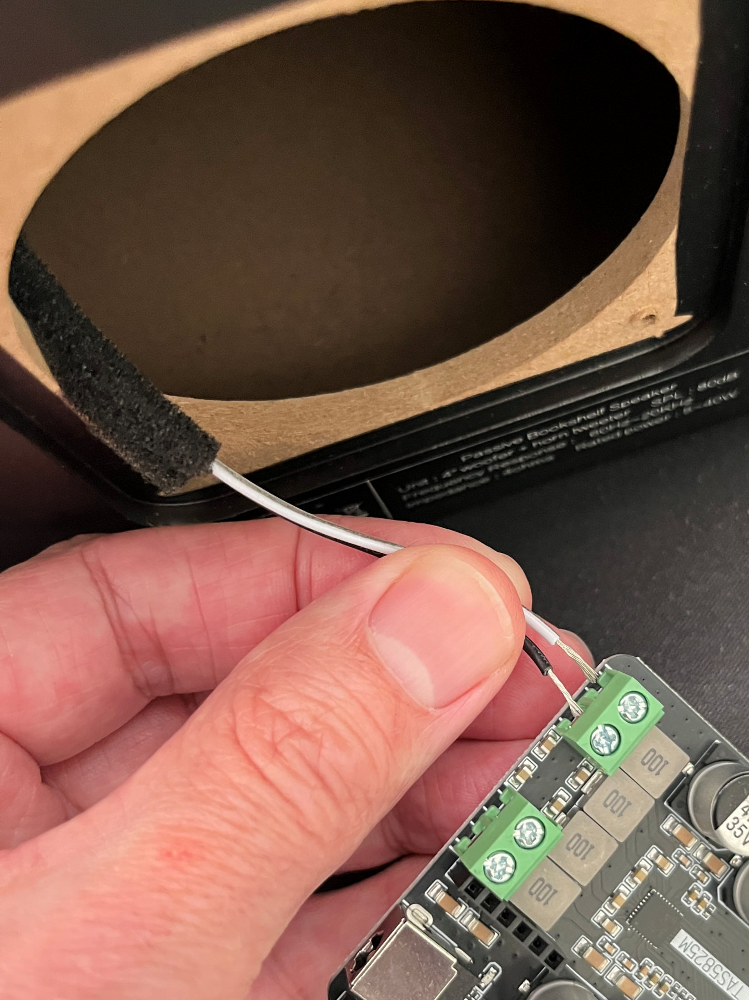
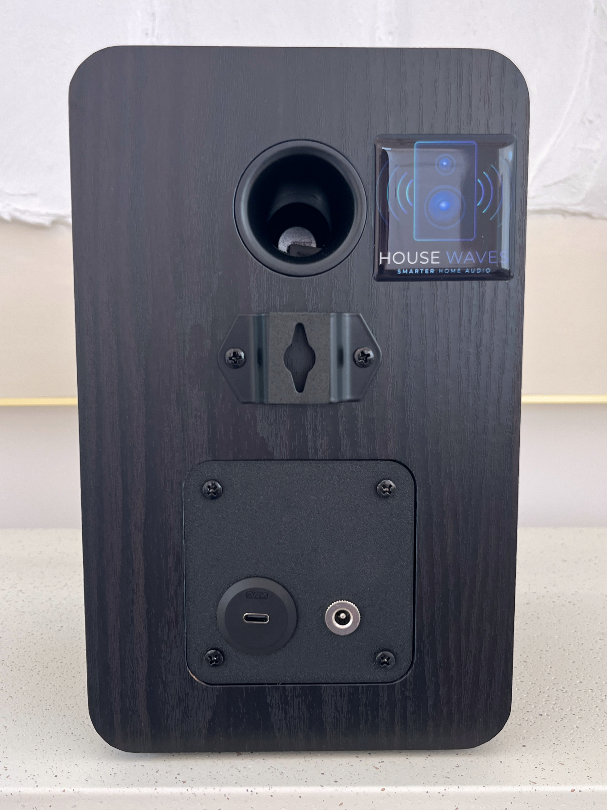
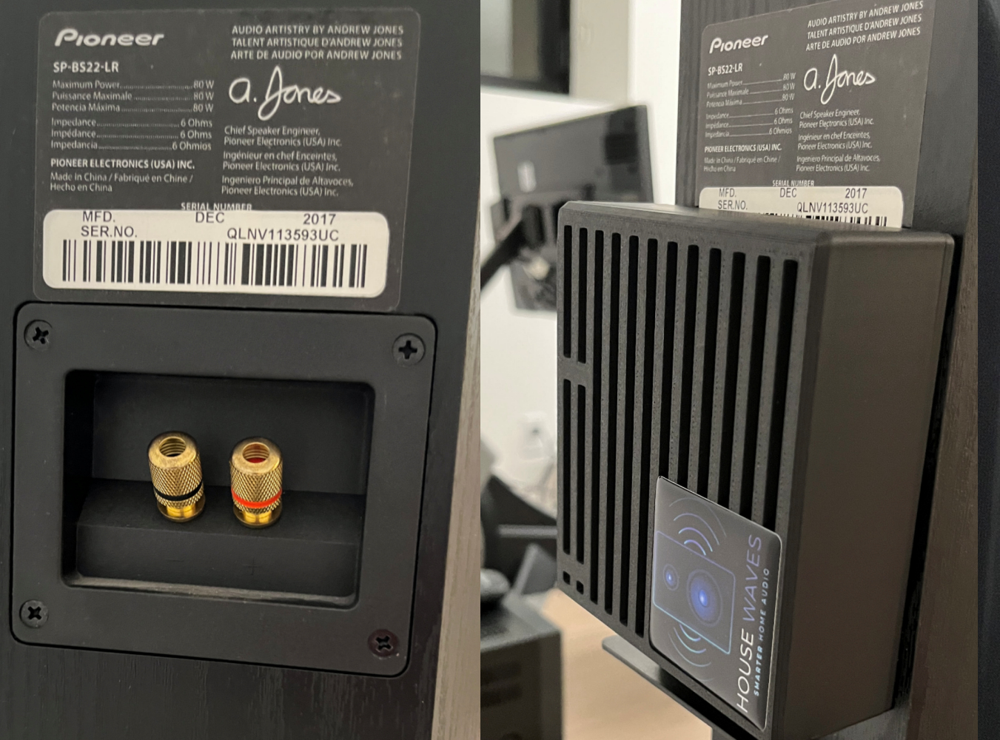

# V4 - DIY $125 Home Assistant bookshelf speaker with ESPHome SendSpin, Snapcast, AirPlay 2, Squeezelite for whole-home music and notifications.

### Quickly modify an off-the-shelf, dual-driver passive speaker using open-source hardware and pre-configured open-source firmware (ESPHome with SendSpin and many other options) for multi-room synchronized audio and TTS notifications using Music Assistant and Home Assistant. Automatically connects to Home Assistant at bootup. No coding, no cloud, no subscriptions, no integrations. 

## Build or Buy ?

**This project is very simple and fast to build.** 
**But not everyone has the time or desire for a DIY project.**
**If that's you, please check out the section below [Option to Purchase - Ready to Connect](#option-to-purchase---assembled-tested-ready-to-connect)**

*Completed modification of a passive speaker for fast and easy streaming with ESPHome, SendSpin and Home Assistant.*

## See and Hear it

- [45 sec video demo on YouTube: two HW3s streaming music in sync](https://www.youtube.com/watch?v=vsdZfq3pha4) 

---

## Table of Contents

- [What This Is](#what-this-is)

- [Motivation](#motivation)

- [Option to Purchase - Ready to Connect](#option-to-purchase---assembled-tested-ready-to-connect)

- [Caveats & Limitations](#caveats--limitations)

- [Parts & Materials](#parts--materials)

- [Tools Required](#tools-required)

- [Build Time](#build-time)

- [Step-by-Step Build Guide](#step-by-step-build-guide)

- [What's Next](#whats-next)

- [Non-Commercial Use Only](#non-commercial-use-only)

- [Credits & References](#credits--references)

  

---

## What This Is 

- A documented process to easily and quickly create your own Home Assistant speaker by modifying inexpensive, commercially available passive speakers.

- A DIY guide to adding a really exceptional open-source ESP32-based controller from Sonocotta with integrated DAC, DSP and AMP with existing, open-source firmware to stream using SendSpin, Snapcast, Squeezelite or even AirPlay 2 protocols. In this guide, I will provide two options to flash with ESPHome/SendSpin and Squeezelite.

- Provide Music Assistant users a viable alternative to purchasing Sonos, Wiim, Edifier, et. al. speakers to obtain satisfying multi-room synchronized audio without the specialized integrations, cloud services or complex customizations that are generally needed for streaming and/or TTS notifications.

- **Part of a planned series modifying a range of speakers at multiple price points and corresponding sound quality.**
  — see [What's Next](#whats-next) for planned future builds for high-fidelity, subwoofer and smart options.
  
  

**This is NOT:**

- A project that requires wood working skills to build a speaker cabinet from scratch.  At most, you may need to drill a single hole - or have someone 3D print a small plate for you. There are companies that can print and ship you the part for approx $10.

- A smart speaker. Stay tuned for a future build this year.   For those of you following this series, I really appreciate your patience. The pace of growth I have experienced and the progression of ESPHome/SendSpin has been exciting. Now that SendSpin is very close to GA, the timing to create smart speakers is accelerating.

  

---

## Motivation

There are no commercially available speakers specifically for use in the Home Assistant platform. Sure, you can find WiFi and BT speakers that can be integrated into HA, but they are either expensive, proprietary, complicated to integrate, etc., etc.

I want to change that.

***My first project***, really more of a proof-of-concept, started with a high end speaker kit. It was expensive. 
[DIY WiFi & BT audio speaker for Home Assistant, modify prebuilt 3D printed speaker](https://www.reddit.com/r/homeassistant/comments/1qw1gg6/diy_wifi_bt_audio_speaker_for_home_assistant/)

It sounded great!  But $250 / speaker was not what people wanted. 

***My second project*** was a much lower cost version based on a commonly available single-driver speaker available on Amazon. A desktop-sized solution, with limited power and frequency range, but ideal for replicating in multiple rooms primarily for notifications and occasionally listening to music (or secondary rooms as part of a whole home, multi-room system).    [V2 - $60 DIY WiFi & BT audio speaker for Home Assistant, with ESP32 - Squeezelite or SendSpin : r/homeassistant](https://www.reddit.com/r/homeassistant/comments/1skggdr/v2_60_diy_wifi_bt_audio_speaker_for_home/)

**My third project** was a dual-driver, compact bookshelf speaker capable of providing quality audio with 15W to adequately fill small rooms of your home in a cabinet slightly larger than a desktop speaker.  [V3 - $90 DIY Home Assistant bookshelf speaker for Home Assistant](https://www.reddit.com/r/musicassistant/comments/1t6ah47/v3_diy_90_home_assistant_bookshelf_speaker_for/)

-------

***This is my fourth project (V4)*** 

A larger dual-driver speaker capable of providing decent bass in a bookshelf form factor with significant amplification from 30W of power.  This is getting very close to a substitute for home audio systems. 

*Unlike the past projects, you will not need to remove a driver in the cabinet.  This speaker has a very large wire terminal plate that easily fits the ESP32 board in an RPi case. So the process is even easier than in the past.*

For clarification - we're still at the lower end of the audiophile spectrum. I'm nowhere near trying to make a claim this competes with high-end gear, but we're just getting warmed up...

---

## Option to Purchase - Assembled, Tested, Ready to Connect

My motivation is not completely altruistic.

I've started a company - with a commitment to prioritize and provide DIY open-source audio options to Home Assistant enthusiasts.  These guides are part of that commitment.

For individuals who prefer to purchase a speaker fully assembled, tested and updated, well...that's the market I'd like to help with...I want to be the RATGDO for music enthusiasts looking for options that do not require subscriptions or proprietary applications. 

Please check out my site, [GetHouseWaves.com](https://gethousewaves.com/)  to view available models - all using the same open-source controllers and firmware you'll find in my DIY guides.

Whether you build it or buy it, your speakers will always be yours to do with as you please. 

You will never be locked-in or bricked-out.

---

## Caveats & Limitations

- Speaker DAC and AMP power is provided by a remarkable [ESP32 board called "LOUDER PLUS"](https://github.com/sonocotta/esp32-audio-dock) by [Sonocotta](https://github.com/sonocotta). 

  - Special thanks to [Andriy](https://discord.com/invite/PtnaAaQMpS) for all the help and support in my endeavor. You've been a great person to team with

- The board provides options to use both (or either) a USB-C adapter and an external power supply.  

  - You do not need to use both at the same time.

  - The USB-C connection limits the amplification power to 15W - roughly what most mobile phone adapters supply (USB-C at 5V, 2-3A).   I would encourage you to try this first - it is definitely louder than the V3 - even with just USB-C power.

  - An option for an external power supply is listed in the parts table.  If you choose another product - do NOT exceed 12V DC and stay under 36W max - or you may fry the board, the speaker - or both.

- ***Speakers benefit from "run-in" time to loosen the driver suspension and improves audio quality over time.*** 

  - *Speaker drivers are stiff when new and improve from use.*
  - *You can actually notice the sound quality of speakers improve over time.*
  - **You can damage speakers easily by playing them too LOUD too soon.**
  - Use your speakers at least 50-100 hours at mid-range volumes (50% or lower in Music Assistant) before testing how loud they can go.

  

---

## Parts & Materials

---

Prices shown are approximate USD and include shipping, taxes and customs fees (to someone in California). 

Speakers are sold in pairs, but other parts are sold individually. Adjust quantities if you plan to build both.

Links are for the actual products I purchased for building the POC.

 

| #    | Component                                                    | Qty        | Price | Notes                                                        |
| ---- | ------------------------------------------------------------ | ---------- | ----- | ------------------------------------------------------------ |
| 1    | [Riowois Passive Bookshelf Speakers with 4" woofer](https://www.amazon.com/dp/B0F995JR2P) | 2 cabinets | $67   | $38/speaker;  GET THE 4" WOOFER - the other model is for V3 tutorial!!! need to buy outside the US? search for Riowois DS6800M |
| 2    | [Sonocotta LOUDER PLUS ESP32](https://www.elecrow.com/louder-esp32-plus.html) - Sold by Elecrow   or   [Sonocotta LOUDER PLUS ESP32](https://lectronz.com/products/louder-esp32-plus) - Sold by Lectronz | 1          | $37   | ESP32 with integrated DAC & AMP;  - no Ethernet module;  - optional $5 RPi case to protect the circuit board   Elecrow based in China but delivers to US with much lower shipping & customs fees.   Lectronz is based in EU for purchasing directly from Andriy at Sonocotta    There are currently no US based suppliers for these boards  **buy two if modifying both speakers.** |
| 3    | [USB-C Panel Mount Cable](https://www.amazon.com/dp/B0DRVKR5F4) | 1          | $15   | improved version since v2; the threaded portion is hidden inside the cabinet along with the retaining nut **buy two if modifying both speakers.** |
| 4    | [DC Power Connector](https://www.amazon.com/dp/B0B6FDYTQM)   | 3          | $10   | 5.5mm, 2.1mm pin female barrel connector is fairly standard for DC power supplies, usually with + polarity for the pin - be sure to verify |
| 5    | Optional back plate                                          | 1          | $9    | If you have access to a 3D printer, print the 80mm square plate to replace the speaker wire connection plate and secure the new connectors in the back (STL file included).   Another option is to [order custom 3D printing from Elecrow](https://tidd.ly/4tkovc0) or similar DIY service company. They are as cheap as $2 plus shipping (which was $7 for me) Otherwise, you can just drill a small hole in the back of the cabinet for the cable.   **print two if modifying both speakers.** |
|      |                                                              |            |       |                                                              |

------

## Tools Required

- Phillips screwdrivers (regular size for panel screws and small size for circuit board)
- Wire cutter/stripper
- Pliers (tighten the cable retaining nut)
- Access to a 3D Printer (print the retaining plate to hold the USB-C cable)
  -OR-
  Electric drill and 5/8" drill bit (drill hole in the cabinet to hold the USB-C cable)
  *Pro-tip: If you decide to drill into your cabinet, a "brad-point" drill bit will provide a cleaner hole;* 
  *ALSO Place a strip of tape over the drilling location to prevent/limit tearing of the veneer covering.*
- Computer and USB-C cable (firmware install)

---

## Build Time

- Less than 1 hour per speaker.

---

## Step-by-Step Build Guide

### Step 1 — Remove the existing terminal plate on the back

1. Remove the 4 screws from the wire connector plate ("speaker terminal plate")

2. Pull out the wire connector plate and cut the speaker wires as close to the connector tabs as possible.  In my speaker, these were white (positive) and black (negative).  You will strip the ends of these wires so keep them as long as possible.

3. Keep the plate if you are not going to use the optional 3D printed plate.  You will need it to seal the speaker cabinet as the last step.

4. **DO NOT CUT other wires inside the cabinet!  **
   **The tweeter and woofer drivers are also connected by wires - these need to remain connected!**

   

   
   *Closeup of the wire connector plate in the back of the speaker.*

*Closeup of the wire connector plate before cutting the attached speaker wires. Cut right next to the solder connections.*

---

### Step 2 — Install USB-C and power connectors

1. TWO OPTIONS:

   **ONE** -- If you have access to a 3D printer, you can print the 80mm square plate with holes that fit the USB-C cable and DC power connector as shown in the photo shown below. This plate is the same size and shape as the speaker connector plate you just removed. An STL file has been provided for this part. 

   Insert the threaded USB-C connector inside the hole of the plate, securing in place with the plastic nut. Insert the USB-C cable into the ESP32 board.

   Insert the threaded DC power connector inside the hole of the plate, securing in place with the metal nut. Connect the red and black wires to the ESP32 board as shown in the photo. The connection polarity is also printed on the back of the ESP32 board for reference.

   **OR**

   **TWO** -- you can drill a 5/8" hole in the back of the speaker cabinet or the existing plate. I did not attempt this, but one of our readers and contributors drilled a hole into the original wire connector plate.  [See the photo here.](https://github.com/HouseWaves/home-assistant-audio-speaker-v3/issues/2#issuecomment-4635195475)
   
   OPTIONAL - if you decide to drill the original connector plate - you could power two speakers on one ESP32 board. Another reader/contributor connected the wire terminals to the LEFT side of the ESP32 board.  By connecting the two speakers together with speaker wire, he now has a stereo pair - one speaker has the ESP32 board inside and the other is connected using the speaker wire - both powered by a single board.
   
   

*Closeup of the USB-C connector cable and the 3D printed plate that replaces the original speaker wire plate.*

---

### Step 3 — Attach speaker driver wires to the ESP32 board

1. OPTIONAL - if you are using an RPi case for protection, attach the LOUDER PLUS ESP32 board to the base of the RPi case (as shown in the photo below).  I recommend not enclosing the board with the top half; this allows air flow to keep the ESP32 amplifier cool at loud volumes.  

2. Gently strip approx 1/4" on the ends of the white and black driver wires.

3. Attach the wires to the speaker terminals of the board, paying attention to the driver polarity. The white wire was "+" and should be connected to the outermost terminal on the ESP32 board.  The connectors near the corner are for the RIGHT channel. You can choose either LEFT or RIGHT - as the Music Assistant will let you change whether it streams LEFT, RIGHT or MONO to the board -  so it does not matter which side you choose. 
   OPTIONALLY, you may also wire for PBTL, a slightly advanced topic that will require ESPHome/SendSpin and some additional coding changes. [You can find more information about the advantages and changes needed here](https://github.com/sonocotta/esp32-audio-dock#louder-tas5805m-dac)

   

*Connecting the speaker driver wires to one (RIGHT) channel of the LOUDER PLUS ESP32 circuit board.*

### Step 4 — Flash the ESP32 controller 

You have several options for firmware, including ESPHome with SendSpin or Snapcast, Squeezelite, custom and [even using AirPlay 2](https://sonocotta.com/esparagus-with-airplay-2/). You may use any of them. 

There are matrices that discuss the pros and cons of each option. [This is a good starting point to review.](https://sonocotta.com/loud-esp32/) 

I have found both Squeezelite and now SendSpin, to be very good options for quickly and easily connecting devices to Home Assistant (Music Assistant will auto-discover either one). The process to help you install either Squeezelite or SendSpin are included in Readme docs linked below.

1 - [Install Squeezelite Firmware](README-Firmware-Flash-Squeezelite.md)

2 - [Install SendSpin Firmware](README-Firmware-Flash-SendSpin.md)

---

### Step 5 — Test before closing up

I recommend checking the board has been discovered by Music Assistant and streams music before closing it up. 

---

### Step 6 — Final Assembly

1. Carefully slide the ESP32 board inside the connector plate hole. If you insert the speaker wires/connections in first, you should be able to carefully rotate the board as you slide it through the hole - this will allow you to keep the USB-C cable connected to the ESP32  (it's tricky to reconnect it inside the cabinet.)

2. Continue to slide the board towards the back of the cabinet. OPTIONALLY, you may want to place 1-2 pieces of double-sided foam tape under the RPi case to attach it to the bottom of the speaker cabinet. This will both hold it in place and keep the speaker vibrations at loud volumes from vibrating/rattling the case and board.

3. Insert your new connector plate (or the old wire connector plate if using that one) and replace the screws.
   
   
   
   
   
   *Closeup of the back of the speaker with the new printed plate and connectors in place.*

---

## What's Next

This is **Build #5** in a planned series of passive-to-active speaker conversions for multi-room audio with Home Assistant. 

| Build | Speaker                                                      | Status        |
| ----- | ------------------------------------------------------------ | ------------- |
| #1    | HouseWaves POC -  Tozzi One High Fidelity Speaker Kit for Home Assistant | ✅ Complete    |
| #2    | HouseWaves-One: Low-cost (sub $50) single driver speaker     | ✅ Complete    |
| #3    | HouseWaves-Two: Mid-range, mid-cost (sub$100), dual driver speaker | ✅ Complete    |
| #4    | SendSpin firmware for use with HW-One and HW-Two speakers    | ✅ Complete    |
| #5    | HouseWaves-Three: Higher fidelity speaker option for Home Assistant | ✅ Complete    |
| #6    | HouseWaves-Legacy: Connect any passive speaker to Home Assistant in 3 minutes | 🔜 July 2026   |
| #7    | smart speaker option, compatible with Home Assistant Voice Preview | 🔜 August 2026 |

##### Preview of HouseWaves-Legacy

##### Connect ANY old (or new) passive speakers to Home Assistant in three minutes.

---

## Non-Commercial Use Only

##### SUMMARY (For details, please read LICENSE.md)

I developed this speaker modification to be accessible to everyone for learning and enjoyment. To keep the project's spirit alive and ensure it remains open for the Home Assistant and Music Assistant community, here is how I define the boundaries of the **CC BY-NC 4.0** license:

### ✅ What is Encouraged (Personal & Academic)

- **Personal Use, Gifting, Education and Modding.**

### ❌ What is Prohibited (Commercial)

- **Selling Finished Units, Paid Assembly Services, Commercial Production of Units, Commercial Content.**

> **The "Materials Fee" Exception:** If you are organizing a community build or a school workshop, charging a "at-cost" fee to cover the raw price of components (drivers, filament, boards) is perfectly fine. As long as you aren't making a profit on my engineering and documentation, you are within the spirit of the license.

---

## Credits & References

- [Sonocotta Loud ESP32 Documentation](https://github.com/sonocotta/loud-esp)

- [Squeezelite Loud ESP32 Firmware Installation Page](https://sonocotta.github.io/esp32-audio-dock/)

- [Squeezelite-ESP32 GitHub Page](https://github.com/sle118/squeezelite-esp32)

- [Music Assistant for Home Assistant](https://music-assistant.io/)

- [Home Assistant Media Player Integration](https://www.home-assistant.io/integrations/media_player/)

  

---

***Build #2026-06-15 | HouseWaves, Copyright, 2026.***

